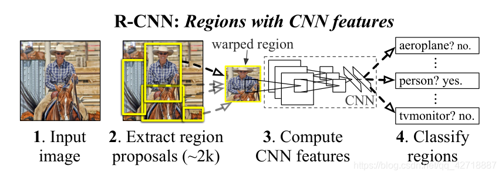
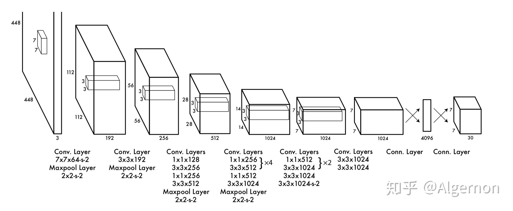
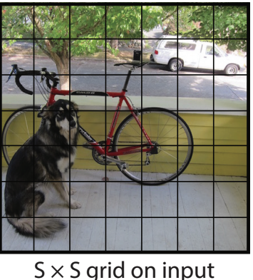

# 📖YOLOV1速览

 ## 1️⃣知识前导

### RCNN（两阶段）

#### 1.生成候选区域（Region Proposals） 

**Selective Search** 方法：

- 先对输入图像进行 **多尺度分割**，生成一系列超像素（Superpixels）。
- 逐步合并相似的区域，形成不同大小的候选框（Region Proposals）。
- 最终生成 **大约 2000 个候选区域**，这些区域被认为可能包含目标。

#### 2.特征提取（Feature Extraction）

**使用 AlexNet对每个候选区域进行特征提取**：

- **将每个候选区域缩放到固定大小**（如 224×224）。

- **送入 CNN 提取特征**（通常使用预训练的 CNN，如 AlexNet、VGG16）。

- **得到特征向量**，并存入 SVM 进行分类

#### 3. 分类与回归

RCNN 采用 **两个独立的模型** 来进行目标分类和边界框修正：

- 目标分类（Classification）
  - 采用 **SVM（支持向量机）** 对 CNN 提取的特征进行分类，判断该候选区域属于哪个类别（如 "cat", "dog", "car"）。
- 边界框回归（Bounding Box Regression）
  - 由于 Selective Search 生成的候选框可能不够准确，RCNN 训练了一个 **线性回归模型** 来调整边界框的位置，使其更贴合目标。

#### 4. 进行目标检测

- 由于 多个候选区域可能覆盖同一个目标，会导致多个检测框。为了得到最终的检测结果，RCNN 采用：
  - 非极大值抑制（NMS, Non-Maximum Suppression）：
    - 按置信度排序，删除与高置信度目标重叠度高（IOU > 阈值）的框，保留最优框。
- 最终输出检测结果，包括：
  - **类别标签**
  - **目标位置（Bounding Box: x, y, w, h）**

## 2️⃣YOLOv1（单阶段）

### 核心思想：

1、**把目标检测视为一个单一的回归问题**，即从输入图像直接预测目标的类别和位置，而不是像 RCNN 那样先生成候选区域再分类。

2、**整张图像只通过一次 CNN 前向传播**，直接得到所有目标的类别和边界框，因此速度极快，适用于**实时检测**。（端到端）

### 算法流程

#### 预测阶段：

##### 1. 将输入图像划分为网格

- 将图像缩放到固定尺寸（448x448）

- 把输入图像划分成 **S × S 的网格**（比如 7×7）。
- 每个网格的作用：
  - 如果一个物体的中心落在某个网格中，这个网格就负责检测这个目标。

##### 2.前向传播

##### （1) 每个网格预测多个边界框

- 每个网格（Cell）预测 B 个边界框（Bounding Boxes）和对应的置信度（Confidence Score）：
  - 边界框信息：(x, y, w, h)
    - (x,y)(x, y)(x,y) 表示目标中心相对于该网格的位置（归一化到 0~1）。
    - (w,h)(w, h)(w,h) 是目标相对于整张图像的宽高（归一化到 0~1）。
  - **置信度（Confidence）**：表示边界框内是否有物体。

##### （2) 每个网格同时预测类别（Class Prediction）

- **每个网格还会预测 C 个类别的概率**。
- 但注意，类别的概率是**条件概率**，表示**在该网格有物体的前提下，该物体属于某个类别的概率**。

**最终输出形状**：S×S×(B×(5+C)),对于YOLOv1输出7x7x30

##### 3.后处理

###### (1) 计算边界框的实际坐标

$$
x_r = (x_p + c_x) * \text{grid\_size}
$$

$$
y_r = (y_p +c_y)*\text{grid\_size}
$$

$$
w_r = w_r*\text{img\_width}
$$

$$
h_r = h_p * \text{img\_height}
$$

###### (2)计算最终的置信度分数

YOLO 计算每个边界框的 **置信度分数**（Confidence Score）：
$$
\text{Confidence} = P(\text{Object}) \times \text{IOU}_{\text{pred, truth}}
$$

- **P(Object)**：网格是否包含目标的概率。
- **IOU（Intersection over Union）**：预测的边界框与真实目标的重叠程度。

$$
IOU = \frac{\text{Area}_{\text{intersection}}}{\text{Area}_{\text{union}}}
$$

置信度过低的框会被丢弃（通常设定阈值，比如 **0.25**）。

###### **(3) 非极大值抑制（Non-Maximum Suppression, NMS）**

由于 YOLO 可能对同一个目标预测多个边界框，需要去重：

1. **按置信度排序**：优先保留置信度高的框。
2. **计算 IOU（交并比）**
3. **删除高 IOU（>0.5）的重复框**，只保留最优的目标框。

##### 后处理可视化

###### NMS详解

#### 训练阶段

##### （1）**数据预处理**

- 图像归一化
- 划分网格
- 生成标签格式 

##### （2）**前向传播**

- 通过 **CNN 提取特征** 并预测目标信息。

##### （3）计算损失

- 位置损失（Localization Loss）

$$
\lambda_{\text{coord}} \sum_{i=0}^{S^2} \sum_{j=0}^{B} \mathbb{1}_{ij}^{\text{obj}}
\left[ (x_i - \hat{x}_i)^2 + (y_i - \hat{y}_i)^2 \right]
$$

- 尺度损失（Scale Loss）

$$
\lambda_{\text{coord}} \sum_{i=0}^{S^2} \sum_{j=0}^{B} \mathbb{1}_{ij}^{\text{obj}}
\left[ (\sqrt{w_i} - \sqrt{\hat{w}_i})^2 + (\sqrt{h_i} - \sqrt{\hat{h}_i})^2 \right]
$$

- 目标置信度损失（Confidence Loss for Objects）

$$
\sum_{i=0}^{S^2} \sum_{j=0}^{B} \mathbb{1}_{ij}^{\text{obj}} (C_i - \hat{C}_i)^2
$$

- 背景置信度损失（Confidence Loss for No Object）

$$
\lambda_{\text{noobj}} \sum_{i=0}^{S^2} \sum_{j=0}^{B} \mathbb{1}_{ij}^{\text{noobj}} (C_i - \hat{C}_i)^2
$$

- 分类损失（Classification Loss）

$$
\sum_{i=0}^{S^2} \mathbb{1}_{i}^{\text{obj}} \sum_{c \in \text{classes}} (p_i(c) - \hat{p}_i(c))^2
$$

- 最终损失函数（YOLO Loss）

$$
\mathcal{L} = \lambda_{\text{coord}} \sum_{i=0}^{S^2} \sum_{j=0}^{B} \mathbb{1}_{ij}^{\text{obj}}
\left[ (x_i - \hat{x}_i)^2 + (y_i - \hat{y}_i)^2 \right]
+ \lambda_{\text{coord}} \sum_{i=0}^{S^2} \sum_{j=0}^{B} \mathbb{1}_{ij}^{\text{obj}}
\left[ (\sqrt{w_i} - \sqrt{\hat{w}_i})^2 + (\sqrt{h_i} - \sqrt{\hat{h}_i})^2 \right]
+ \sum_{i=0}^{S^2} \sum_{j=0}^{B} \mathbb{1}_{ij}^{\text{obj}} (C_i - \hat{C}_i)^2
+ \lambda_{\text{noobj}} \sum_{i=0}^{S^2} \sum_{j=0}^{B} \mathbb{1}_{ij}^{\text{noobj}} (C_i - \hat{C}_i)^2
+ \sum_{i=0}^{S^2} \mathbb{1}_{i}^{\text{obj}} \sum_{c \in \text{classes}} (p_i(c) - \hat{p}_i(c))^2
$$

